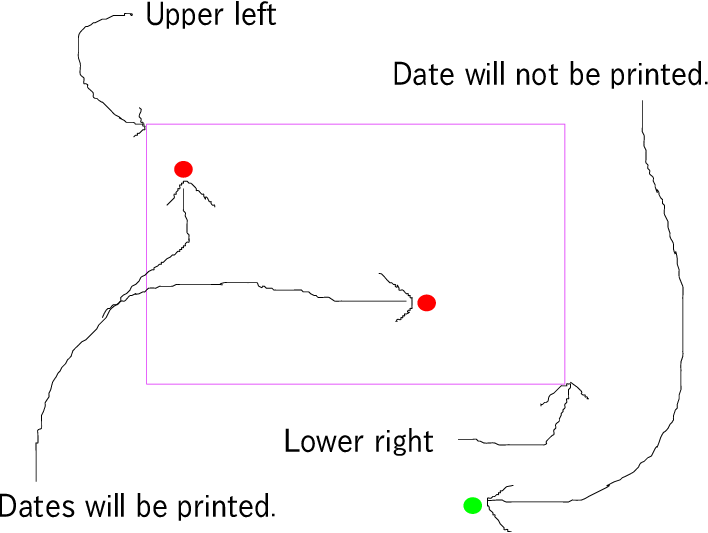

# sdlh

[](https://travis-ci.org/hogehiga/sdlh)

## What is this?
This is a tool resolving "When I went in there?".

## Example of use
```
$ java -jar sdlh-*-jar-with-dependencies.jar 40.0000000 126.0000000 30.0000000 130.0000000 location-history.json
2014/01/01
2014/01/03
```

## Detail of Input/Output
### Input
Upper left latitude, Upper left longitude, Lower right latitude, Lower right longitude, data of Google Location History.

- Data of Google Location History is the JSON file which is exported from Google Takeout.

### Output
Dates when coodinates in location history are recorded within the specified range.


